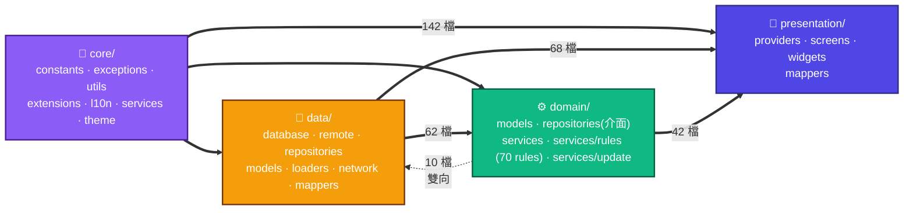
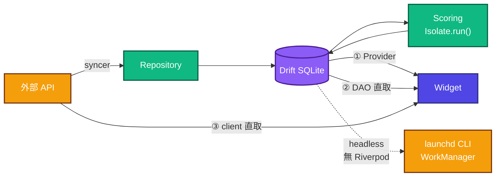

---
paths:
  - "lib/core/**"
  - "lib/data/**"
  - "lib/domain/**"
  - "lib/presentation/**"
  - "lib/app/**"
  - "lib/main.dart"
---

# 架構分層

> ⚠️ **這裡畫的是實際的 import 方向,不是理想的 clean architecture。**
> 兩者差很多,而差異本身才是這份文件的價值——照理想圖推論會推錯。

箭頭方向＝「被誰 import」，數字＝實測的檔案數（2026-08-23）。三件會讓人推錯的事：

1. **`presentation` 直接吃 `data/` 比吃 `domain/` 還多**（68 vs 42）。Provider 常繞過
   domain 直接打 DAO，甚至直接用 remote client。「UI 只跟 domain 講話」是錯的。
2. **`data` 與 `domain` 是雙向的**（domain→data 62 檔、data→domain 10 檔），不是單向。
3. **`domain/repositories/` 的「介面」沒有隔開 Drift**——7 個檔裡 6 個直接 import
   `data/database/app_database.dart` 拿 row type。那層抽象邊界實際上不存在。

**唯一真正單向的是 `core/`**：它不 import 上面任何一層（守門：
`test/core/core_layer_purity_test.dart`，含 >30 檔的 sanity floor 防假綠）。跨層共用的
純值物件（如 `chip_strength.dart`）下沉 `core/constants/`，計算邏輯歸 `domain/services/`。

## 三條讀取路徑

UI 的資料**不是只有一條路**。畫成單線會讓人以為改 Repository 就能攔截全部。

| 路徑 | 說明 |
|:---|:---|
| ① Provider | 標準路徑,但**不是多數** |
| ② DAO 直取 | Provider 繞過 domain 直接讀 DAO(法人排行、營收總覽、季報總覽等) |
| ③ client 直取 | 個股詳情、大盤總覽直接打 remote client,不經 DB |
| headless | `lib/app/headless_update_runner.dart` **完全不建 Riverpod container**——launchd CLI 與 WorkManager 背景 isolate 的唯一入口 |

**Scoring 在獨立 isolate**(`Isolate.run()`):static 不跨界,曾造成 AOT CLI 的規則/評分
日誌全部靜默,見 `scoring_isolate.dart` 的註解。
