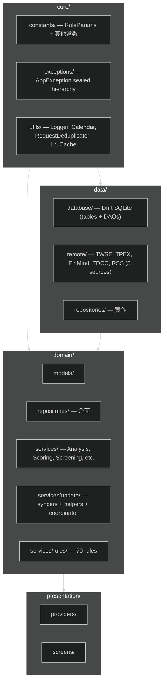
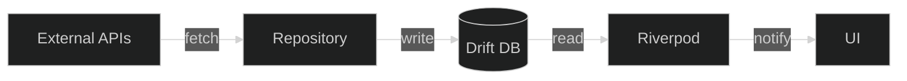

---
paths:
  - "lib/core/**"
  - "lib/data/**"
  - "lib/domain/**"
  - "lib/presentation/**"
---

# 架構分層圖

**core 純度不變量**：`lib/core/` 不得 import domain／data／presentation（守門：`test/core/core_layer_purity_test.dart`）。跨層共用的純值物件（如 `chip_strength.dart`）下沉 `core/constants/`，計算邏輯歸 `domain/services/`。

## 資料流

