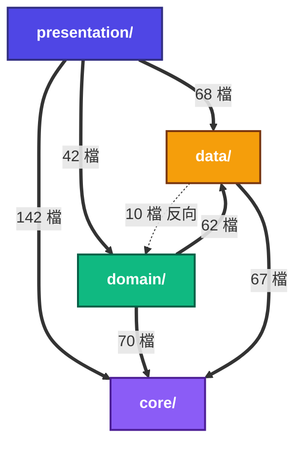
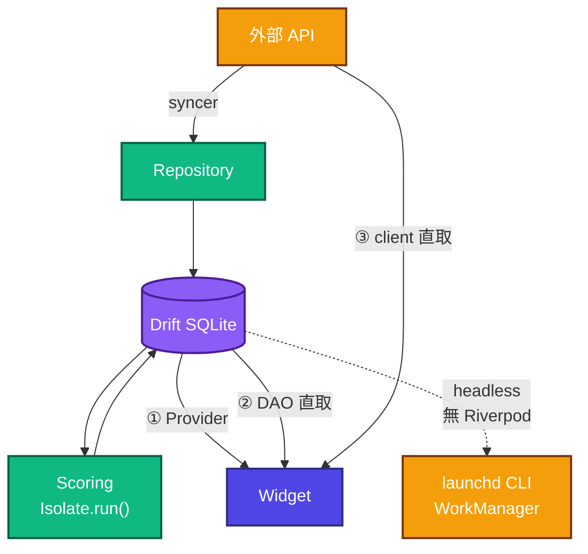

---
paths:
  - "lib/core/**"
  - "lib/data/**"
  - "lib/domain/**"
  - "lib/presentation/**"
  - "lib/app/**"
  - "lib/main.dart"
---

# 架構分層

> ⚠️ **這裡畫的是實際的 import 方向，不是理想的 clean architecture。**
> 兩者差很多，而差異本身才是這份文件的價值——照理想圖推論會推錯。



| 層 | 檔數 | 子目錄 |
|:--|--:|:--|
| `core/` | 73 | constants · exceptions · utils · extensions · l10n · services · theme |
| `data/` | 132 | database · remote · repositories · models · loaders · network · mappers |
| `domain/` | 95 | models · repositories(介面) · services（含 services/rules 的 **70 rules**、services/update） |
| `presentation/` | 156 | providers · screens · widgets · mappers |

**箭頭＝「A import B」**（標準依賴方向），數字＝A 之中 import 到 B 的檔案數。所以最上層是 presentation、最底層是 core。

> 下列數字是 2026-08-23 的快照，**會隨檔案增減漂移**。重新量（會自動列出所有存在的邊，
> 未來新增的依賴方向也會自己冒出來）：
>
> ```bash
> for a in core data domain presentation; do for b in core data domain presentation; do
>   [ "$a" = "$b" ] && continue
>   n=$(grep -rl "package:daredevil/$b/" lib/$a/ 2>/dev/null | wc -l | tr -d ' ')
>   [ "$n" -gt 0 ] && printf '%s → %s: %s 檔\n' "$a" "$b" "$n"
> done; done
> for l in core data domain presentation; do printf '%-14s %s 檔 / %s 子目錄\n' "$l/" \
>   "$(find lib/$l -name '*.dart' | wc -l | tr -d ' ')" "$(ls -d lib/$l/*/ | wc -l | tr -d ' ')"
> done
> ```

三件會讓人推錯的事：

1. **`presentation` 直接吃 `data/` 比吃 `domain/` 還多**（68 vs 42）。Provider 常繞過
   domain 直接打 DAO，甚至直接用 remote client。「UI 只跟 domain 講話」是錯的。
2. **`data` 與 `domain` 互相 import**（domain 有 62 檔 import data、data 有 10 檔
   import domain），是環不是單向。
3. **`domain/repositories/` 的「介面」沒有隔開 Drift**——7 個檔裡 6 個直接 import
   `data/database/app_database.dart` 拿 row type。那層抽象邊界實際上不存在。

**唯一真正單向的是 `core/`**：它不 import 上面任何一層（守門：
`test/core/core_layer_purity_test.dart`，含 >30 檔的 sanity floor 防假綠）。跨層共用的
純值物件（如 `chip_strength.dart`）下沉 `core/constants/`，計算邏輯歸 `domain/services/`。

## 三條讀取路徑

UI 的資料**不是只有一條路**。畫成單線會讓人以為改 Repository 就能攔截全部。



| 路徑 | 說明 |
|:---|:---|
| ① Provider | 標準路徑，但**不是多數** |
| ② DAO 直取 | Provider 繞過 domain 直接讀 DAO（法人排行、營收總覽、季報總覽等） |
| ③ client 直取 | 個股詳情、大盤總覽直接打 remote client，不經 DB |
| headless | `lib/app/headless_update_runner.dart` **完全不建 Riverpod container**——launchd CLI 與 WorkManager 背景 isolate 的唯一入口 |

**Scoring 在獨立 isolate**（`Isolate.run()`）：static 不跨界，曾造成 AOT CLI 的
規則／評分日誌全部靜默，見 `scoring_isolate.dart` 的註解。
