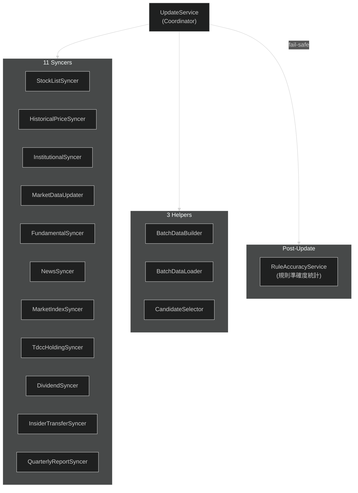

---
paths:
  - "lib/domain/services/update/**"
  - "lib/data/remote/**"
  - "**/syncer*"
  - "**/Syncer*"
  - "**/BatchData*"
  - "**/rule_accuracy*"
---

# Update Pipeline

## Update 元件

- **Coordinator**: `UpdateService` — 協調所有 syncer 執行順序 + 錯誤處理
- **11 Syncers**: 各自從 External API 拉取特定類別資料（stock list、price、institutional、market data、fundamental、news、market index、TDCC holding、dividend、insider transfer、quarterly report）
  - `HistoricalPriceSyncer` 兩段式：**Phase 0 市場日快照回補**（lookback 窗內整市場缺漏的交易日，1 次呼叫補該市場全部股票一天——TWSE MI_INDEX / TPEx afterTrading 歷史端點；單次上限與連續零筆斷路器見 `ApiConfig.historicalMarketDay*`）→ **Phase 1 per-symbol**（補個股殘缺；priority＝自選+熱門追 250 天、非 priority 180 天早退）。**成本分市場**：上櫃走 TPEx `fetchSingleStockPrices` 整段 **1 次**呼叫，上市才是 FinMind `fetchMonthlyPrices` **逐月**；預算估算（`_estimateAvgMonthsNeeded`）據此分流，**查不到市場者一律按上市保守計價**——高估只是回補變慢，低估會放大 `maxSyncCount` 打爆額度。限流中止會把原始例外放進 `HistoricalPriceSyncResult.rateLimitError`（**不 rethrow**，已抓到的資料要保留），caller 據此設 `rateLimitedAbort`
  - `QuarterlyReportSyncer`（2026-08-06）：TWSE/TPEx t187ap06 六業別 × 兩市場共 12 個免額度 openapi 端點,抓「最新一季綜合損益表」官方申報快照寫入 `quarterly_report`。每次更新都跑:公布期端點逐日填充、平時回最後完整季。雙源 per-source 隔離 + 業別 per-variant 隔離;金融業別未申報時回單一全 null 佔位列,model 的 null-aware 解析自然拒收
  - `FundamentalSyncer` 財報有**兩條獨立佇列**：上市走 `UpdateService.selectFinancialSyncTargets`
    （取 `[...twse, ...tpex]` 前 `financialSyncMaxCandidates`）；上櫃另走
    `selectOtcFinancialBacklog`（**最舊優先 + ETF 在取前 N 之前排除**），因為串接下上市候選恆
    遠超上限、上櫃永遠是餘數而餘數是 0。上櫃量由
    `UpdateService.otcFinancialLimitForBudget` 依**剩餘 FinMind 額度**動態下修——回填佇列
    設計上每輪都選得出全新的 stale 股，**重跑不會變便宜**（與上市 needy 為空的性質相反）
  - `MarketDataUpdater` 除當日籌碼外含**當沖/融資缺漏日回補**（TWSE ~21:00 才發布，早更新錯過的日子掃 40 天窗補回；**per-source 斷路器 + 逐市場門檻 + 價格表當停市 ground truth**，設計取捨見 `ApiConfig.tradingBackfill*` 註解）
  - `InstitutionalSyncer` **非破壞式** force：force 只對當日繞快取，歷史回補日走 per-day 完整性檢查（已完整跳過、中斷可續傳）；全清僅由**口徑版本檢核**（`ensureDataVersion`，bump `DataFreshness.institutionalDataVersion` 觸發一次性遷移）承接；回補逐日 `onProgress` 回報
- **3 Helpers**: `BatchDataBuilder`（建構外資/董監等評分資料 Map，含衍生欄位）、`BatchDataLoader`（從 DB 平行載入評分批次資料 → `ScoringBatchData`）、`CandidateSelector`（選出評分候選；市場候選套流動性下限——20 日中位成交值 ≥ 3,000 萬 NTD，自選豁免）
- **跨 syncer 配額**：`ApiBudgetTracker`（per-vendor、sliding 1hr；FinMind free tier
  600/hr 是唯一實際 bottleneck）。狀態經 `ApiBudgetStore` 落 SharedPreferences，
  **跨 app 重啟延續**——純記憶體時重啟即歸零，但 FinMind 伺服器端的額度不會忘記
  （2026-07-27 實測：重啟後本地計數 42/600、伺服器直接回 402）。
  **`restore()` 必須被 await，不可 fire-and-forget**：建構與 `checkBudget` 都是同步的，
  讓載入與呼叫賽跑會讓早期呼叫看到空狀態。掛在 `main.dart` 與 headless runner 起始；
  回傳 `(restoredCalls, cooldownVendors)` 供記錄，沒有這個回報就無法從日誌驗證它生效。
  儲存失敗一律 fail-open 回「無歷史」
- **Post-Update**: `RuleAccuracyService` 在更新後 fail-safe 聚合 per-rule 命中率統計（caller 仍 await，但錯誤不會中斷更新；從 `daily_reason` 聚合寫 `rule_accuracy`，供個股詳情規則表現顯示。**不是 unbiased 統計**——lookahead / survivorship / zero-price 已修，但 **co-occurrence inflation 仍未修**，且 `daily_reason` 只在分數 ≥ `observationScoreThreshold` 時才落庫，故它量到的是「已上榜股票上的規則表現」。逐項揭露見 `rule_accuracy_service.dart` class doc）；`ThesisMonitorService` 同模式檢查釘選論點失效（timeStop 單條件，全量重算冪等）；`TrailingMaAlertService` 同模式重算均線階梯提醒（每檔自選股恰好一筆，依現價落在 5／20／60MA 的哪一階決定提醒方向與價位，**只讀寫 `managed_by = TRAILING_MA` 的列**，使用者手動設的提醒一列不動）。**刻意不做成可選注入**——其餘 fail-safe service 為 null 時整段靜默跳過，而本專案有「自動更新靜默斷 13 天」的前科
