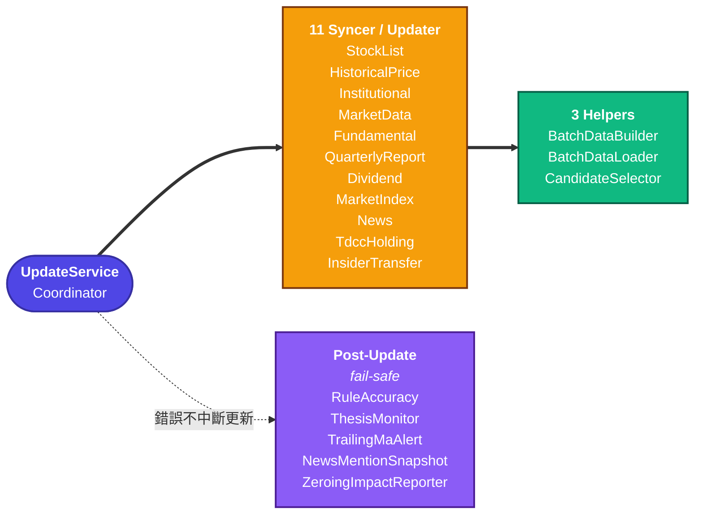

---
paths:
  - "lib/domain/services/update/**"
  - "lib/data/remote/**"
  - "**/syncer*"
  - "**/Syncer*"
  - "**/BatchData*"
  - "**/rule_accuracy*"
---

# Update Pipeline

## Update 元件

### Coordinator

`UpdateService` — 協調所有 syncer 執行順序 + 錯誤處理。
住在 `lib/domain/services/`，**不在 `update/` 底下**（`update/update.dart` 只是 barrel export）。

### 11 Syncer / Updater

stock list、price、institutional、market data、fundamental、news、market index、
TDCC holding、dividend、insider transfer、quarterly report。
以下五個有非顯而易見的行為，其餘照名稱理解即可。

**`HistoricalPriceSyncer`** — 三道閘，缺一都會讓「該補的沒補」看起來像正常結束

- **Phase 0 市場日快照**：lookback 窗內整市場缺漏的交易日，1 次呼叫補該市場全部股票一天
  （TWSE MI_INDEX / TPEx afterTrading 歷史端點）。單次上限與連續零筆斷路器見
  `ApiConfig.historicalMarketDay*`
- **「缺漏」的定義與今日頁共用**：`history_coverage.dart` 的 `findMissingMarketDays`
  同時決定 Phase 0 要補哪些、今日頁「歷史資料建置中 N%」顯示多少——改門檻或窗口兩邊一起變。
  ⚠️ 日曆漏標的休市日（颱風停市、新增國定假日、預估錯的農曆假日）在官方端點回 0 筆，
  **永遠算缺漏**；畫面端以 `HistoryCoverage.isBuilding`（缺漏 > 一輪上限才顯示）容忍，
  回補端則每輪仍會把它排進名額（各 1 次呼叫回 0 筆，並計入連續零筆斷路器）。
  斷路器以（日, 市場）計數：**兩個相鄰的漏標日**＝連續 3 筆零 → 每輪 Phase 0 都停在同一處，
  比它們更舊的缺漏補不到、今日頁的「約再 N 次」也不會收斂，直到漏標日滑出窗口。
  反方向同樣有害：**多列的休市日會被跳過、那天的缺漏永遠不回補**（2025-10-07 曾因此只剩
  55 檔價格）。日曆每年核對：`dart run tool/check_twse_holidays.dart <年>`（年度公告）；
  颱風停市不在公告內，以證交所 FMTQIK 每日成交資訊確認。需更新時每日更新摘要會附「交易日曆待更新」
- **Phase 1 per-symbol**：補個股殘缺。priority（自選＋熱門）追 250 天、非 priority 180 天早退
- **Phase 1 的第三道閘**：覆蓋天數沒長的標的凍結 `DataFreshness.historicalBackfillBackoffDays = 30`
  天並跳過——**「是 needy」不等於「這輪會被同步」**
- **成本分市場**：上櫃燒 FinMind（`TpexPriceSource.fetchSingleStockPrices` 內部呼叫
  `_finMind.getDailyPrices`，整段區間 **1 次**）；上市燒 TWSE
  （`TwsePriceSource.fetchMonthlyPrices` **逐月**，該檔完全沒有 FinMind）
- ⚠️ **類別名會騙人**：`TpexPriceSource` 的單檔歷史走的是 FinMind。真正吃 600/hr 額度的是
  **上櫃**這條，不是上市。預算估算（`_estimateAvgMonthsNeeded`）據此分流，
  **查不到市場者一律按上市保守計價**——高估只是回補變慢，低估會放大 `maxSyncCount` 打爆額度
- 限流中止把原始例外放進 `HistoricalPriceSyncResult.rateLimitError`（**不 rethrow**，
  已抓到的資料要保留），caller 據此設 `rateLimitedAbort`

**`FundamentalSyncer`** — 先吃免費全市場資料，再動 FinMind 佇列

- **前置**（2026-08-16）：`syncMarketWideBalanceSheets` 走六業別 × 兩市場共 12 個**免額度**
  t187ap07 端點，一次補齊全市場資產負債表，讓後面兩條 FinMind 佇列的單位成本**砍半**。
  ⚠️ 因此「財報是額度唯一瓶頸」的舊成本模型已不準
- **單一「最舊優先」佇列**（2026-09-05）：`FundamentalSyncer.selectFinancialBacklog`——自選＋熱門
  優先（不套 ETF 過濾、計入上限），其餘全市場候選**先剔 ETF**、再依 INCOME 最新日期由舊到新
  （無資料視為最舊、同日以代號決勝）取到上限。純排序在 `selectStaleFinancialTargets`
- ⚠️ 之前是兩條佇列：上市取候選前 150（live 路徑候選是**波動度降冪**，cached 路徑是代號升冪），
  上櫃另走最舊優先。前者讓低波動大型股永遠排不進名額窗——app DB 實查 460 檔零 EPS、18 檔當天有
  評分（台灣大、群光、佳世達…），7 條 EPS／ROE 規則對它們無聲不觸發；五輪日誌被回填的 102 檔裡
  0 檔來自那 460 檔。分開兩條的唯一理由是餓死，最舊優先下餓死在結構上不可能，故一併收掉
- **額度節流只剩一個數字**：`UpdateService.financialQuotaForBudget` 回傳 `int`，
  ＝`(budget − used − financialBackfillReserve) ÷ 2` 夾在 `[0, financialSyncMaxCount=200]`；
  0 時整段短路。2026-08-05 季報季修復（全市場同時變 needy、單輪 488 次吃掉 82% 小時額度）的
  reserve=200 機制原樣保留
- 排序查詢失敗 **fail-closed 只回自選＋熱門**：退回全清單會讓整包候選逐檔打 FinMind
- 守門：`test/domain/services/update/financial_backlog_single_entry_guard_test.dart` 掃 lib 斷言
  `syncFinancialStatements(symbols:)` 呼叫點恰 1 且舊佇列符號不得復活
- **回填期**每輪都選得出全新的 stale 股，重跑不會變便宜（額度感知因此必要）；**收斂後**選到的
  都是新鮮股、被 `_filterNeedingStatementSync` 濾成零呼叫——兩句講的是同一條佇列的兩個階段

**`QuarterlyReportSyncer`**（2026-08-06）

- TWSE/TPEx t187ap06 六業別 × 兩市場共 12 個免額度 openapi 端點，抓「最新一季綜合損益表」
  官方申報快照寫入 `quarterly_report`
- 每次更新都跑：公布期端點逐日填充、平時回最後完整季
- 雙源 per-source 隔離 + 業別 per-variant 隔離；金融業別未申報時回單一全 null 佔位列，
  model 的 null-aware 解析自然拒收

**`MarketDataUpdater`** — 除當日籌碼外還有兩類回補

- **當沖／融資缺漏日**：TWSE ~21:00 才發布，早更新錯過的日子掃 40 天窗補回
- **上櫃當沖**（2026-08-23）：走 `/www/zh-tw/intraday/stat`，免費、1 次呼叫拿
  842 檔。**日期語意與上市相反**——該端點無視 `date` 參數、永遠回最新交易日，
  故寫入日期取自回應；上市那條的守衛是「回應日期 ≠ 請求日期就丟棄」。
  另有兩道閘：價格覆蓋不足整批跳過（分母全缺會寫出一整片假的 0，而 0 在當沖
  語意下是合法值），失敗不 rethrow（三個來源裡最不關鍵，中止會犧牲融資與外資
  持股）。**歷史回補不走這條**——端點只給最新日，回補循 FinMind
  `TaiwanStockDayTrading`（逐檔、吃額度，僅手動 CLI）
- **全市場外資持股**（2026-08-16）：`syncAllMarketShareholding` / `backfillForeignShareholding`
  走 MI_QFIIS——同樣是免費、全市場的那一類，加它是為了修 FOREIGN_* 規則在 TWSE/TPEx 之間
  4 倍的觸發不對稱
- **per-source 斷路器 + 逐市場門檻 + 價格表當停市 ground truth**，設計取捨見
  `ApiConfig.tradingBackfill*` 註解

**`InstitutionalSyncer`** — **非破壞式** force

- force 只對當日繞快取；歷史回補日走 per-day 完整性檢查（已完整跳過、中斷可續傳）
- 全清僅由**口徑版本檢核**承接（`ensureDataVersion`，bump
  `DataFreshness.institutionalDataVersion` 觸發一次性遷移）
- 遷移由 **pending marker** 驅動（`isDeepBackfillPending` / `markDeepBackfillComplete`）——
  被限流打斷的那輪下次會**接續**，不會靜默退回 15 天淺窗
- 回補逐日 `onProgress` 回報

### 3 Helpers

| Helper | 職責 |
|:---|:---|
| `BatchDataBuilder` | 建構外資／董監等評分資料 Map，含衍生欄位 |
| `BatchDataLoader` | 從 DB 平行載入評分批次資料 → `ScoringBatchData` |
| `CandidateSelector` | 選出評分候選。流動性下限＝20 日中位成交值 ≥ 3,000 萬 NTD，**套用於市場候選／熱門股／其餘可分析股票三者**，僅自選股豁免 |

### 跨 syncer 配額

`ApiBudgetTracker`（per-vendor、sliding 1hr；FinMind free tier 600/hr 是唯一實際 bottleneck）。

- **兩條路徑用不同的 `ApiBudgetStore` 實作**：Flutter 走 `SharedPrefsApiBudgetStore`，
  **launchd CLI 走 `FileApiBudgetStore`**（純 Dart 檔案）——因為 shared_preferences 是
  flutter plugin，import 進去會把 `dart:ui` 拉進 tool 的純 Dart 鏈
- **跨 app 重啟延續**：純記憶體時重啟即歸零，但 FinMind 伺服器端的額度不會忘記
  （2026-07-27 實測：重啟後本地計數 42/600、伺服器直接回 402）
- ⚠️ **`restore()` 必須被 await，不可 fire-and-forget**：建構與 `checkBudget` 都是同步的，
  讓載入與呼叫賽跑會讓早期呼叫看到空狀態。掛在 `main.dart` 與 headless runner 起始；
  回傳 `(restoredCalls, cooldownVendors)` 供記錄，沒有這個回報就無法從日誌驗證它生效
- ⚠️ **收尾 `flush()` 同樣必要**：自動存檔每 10 次呼叫才觸發一次，run 結束不 flush 會丟掉
  尾端 ≤9 次記帳。**遺失方向是放寬不是保守**——少記 → 下輪超發 → 402，正是持久化要防的
  那件事
- 儲存失敗一律 fail-open 回「無歷史」

### Post-Update（5 個 fail-safe service）

caller 仍 await，但錯誤不會中斷更新。**刻意不做成可選注入**——其餘 fail-safe service 為
null 時整段靜默跳過，而本專案有「自動更新靜默斷 13 天」的前科。

**`RuleAccuracyService`** — 從 `daily_reason` 聚合 per-rule 命中率寫 `rule_accuracy`，
供個股詳情的規則表現顯示。

- ⚠️ **不是 unbiased 統計**：lookahead／survivorship／zero-price 已修，但
  **co-occurrence inflation 仍未修**
- 樣本被限縮在**訊號層**：`_computeUnbiasedRuleStats` 明確再篩一次
  `scoreShort ≥ minScoreThreshold` 或 `scoreLong ≥ minScoreThreshold`（**12**），
  把觀察區 8–11 排除掉。（`daily_reason` 的落庫門檻確實是 `observationScoreThreshold` = 8，
  但那是持久化下限，**不是取樣邊界**。）所以它量到的是「已上榜股票上的規則表現」
- 逐項揭露見 `rule_accuracy_service.dart` class doc

**`ThesisMonitorService`** — 檢查釘選論點失效（timeStop 單條件，全量重算冪等）。

**`TrailingMaAlertService`** — 重算均線階梯提醒。每檔自選股恰好一筆，依現價落在
5／20／60MA 的哪一階決定提醒方向與價位，**只讀寫 `managed_by = TRAILING_MA` 的列**，
使用者手動設的提醒一列不動。

**`NewsMentionSnapshotService`** — 回補最近 N 個本地日的提及數快照，**窗內全量覆寫**
（先刪 `[from, to]` 再寫重算結果）而非 upsert。
⚠️ **唯一例外是新聞來源整段為空時 early return 且不碰 DB**——空陣列視為讀取失敗的保守訊號，
否則一次抓取失敗就會清空整個窗。

**`ZeroingImpactReporter`** — 每日輸出負證據歸零的三個數，讓「歸零有沒有生效、量級多大」
每天可從 log 驗證（2026-07-29 三態 lookup 的配套觀測）。
