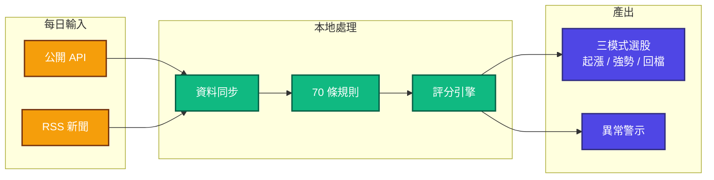

# CLAUDE.md

本檔案為 Claude Code 提供專案開發指引。專題知識按需載入自 `.claude/rules/`。

---

## 專案概述

**Daredevil** — 本地優先盤後台股掃描 App（Flutter / Dart 3）。所有運算在裝置端完成，無雲端依賴。

> **⚠️ 更名的隱藏代價（2026-08-08 實機踩到）**：`PRODUCT_NAME` 改了會產生**新的 .app bundle 名**，而舊的 `afterclose.app` 仍留在 `build/` 且**與新 bundle 共用同一個 bundle ID**。
> LaunchServices 會把該 ID 解析到舊的那個 → 新 app 要求通知授權時系統當場回絕（`requestAuthorization` 4ms 回 false、無對話框、無系統日誌）。
> 清法：`lsregister -u <舊.app>`、刪掉舊 bundle、`lsregister -f <新.app>`。
> 另注意 `flutter run` 是由 dartvm 直接啟動、不走 LaunchServices，通知相關問題要用 `open <app>` 啟動才有代表性。

> **命名邊界（2026-08-07 由 AfterClose 更名）**：對外名稱、repo、Dart package 皆為 `daredevil`；
> 但 **bundle ID 仍是 `com.neo.afterclose`、DB 檔名仍是 `afterclose.sqlite`** —— 它們決定 macOS 容器路徑（`~/Library/Containers/com.neo.afterclose/Data/Documents/`），改動等同 App 換家、既有資料庫（約 58.7 萬列價格，2026-08-07 實測）會看似清空。
> **除非做容器遷移，否則不要動這兩個字串**；文件裡出現它們是實體事實，不是漏改。



---

## 常用指令

```bash
flutter pub get                                                # 安裝依賴
dart run build_runner build --delete-conflicting-outputs        # 程式碼生成 (僅 Drift)
flutter test                                                   # 執行測試
flutter test --coverage                                        # 含覆蓋率報告
flutter analyze --no-fatal-infos                               # 靜態分析
dart format .                                                  # 格式化 (pre-commit hook 自動執行)
```

---

## 關鍵路徑

| 路徑                                             | 說明                                                                                                                                     |
|:-------------------------------------------------|:-----------------------------------------------------------------------------------------------------------------------------------------|
| `lib/core/constants/rule_params.dart`            | 規則參數 barrel（8 domain param 檔 + enums + scores）                                                                                    |
| `lib/core/constants/analysis_params.dart`        | 分析摘要 + 交易成本參數                                                                                                                  |
| `lib/core/exceptions/app_exception.dart`         | 例外階層 (sealed class)                                                                                                                  |
| `lib/core/utils/request_deduplicator.dart`       | Request Deduplication 機制                                                                                                               |
| `lib/domain/services/rules/`                     | 70 條規則 (15 檔案，權威數字見 `RuleRegistry.defaultRules`)                                                                              |
| `lib/domain/services/scoring_isolate.dart`       | Isolate 評分 (typed DTO 序列化)                                                                                                          |
| `lib/domain/services/update/`                    | 更新元件 17 檔 (11 syncer/updater + 3 helpers + 快照/歸零報告各 1 + barrel)；**coordinator `UpdateService` 在上一層 `lib/domain/services/`**                                                                      |
| `lib/data/database/tables/`                      | Drift 資料表定義                                                                                                                         |
| `lib/data/database/dao/batch_query_mixin.dart`   | 批次查詢共享工具 (groupBySymbol)                                                                                                         |
| `lib/domain/services/rule_accuracy_service.dart` | 推薦績效回測引擎 (多週期驗證)                                                                                                            |
| `lib/domain/services/thesis/`                    | 釘選論點失效（timeStop；hardStop/trendBreak 被 gate 砍）                                                                                 |
| `lib/core/theme/semantic_colors.dart`            | 色彩語意分類（紅綠專屬股價，見守門測試）                                                                                                 |
| `lib/core/theme/color_contrast.dart`             | WCAG 對比度／色相／疊色計算——**色彩守門測試專用公式庫**（執行期生產碼不 import；留在 lib/ 是為與色彩宣告同住、供未來生產消費者直接取用） |

---

## 開發工作流程

### Git Hooks

**版控在 `scripts/`,用 `./scripts/install-hooks.sh` 安裝**（只放 `.git/hooks/` 就是未版控、換機消失——本專案已為此吃過兩次虧）。

`pre-commit`：
1. **補做 CLI 重編** — 若上次 post-commit 留下 `.git/cli-rebuild-pending` 就同步補上（失敗則擋下 commit）
2. **Auto-format** — 格式化 staged `.dart` 檔案並重新 stage
3. **Analyze** — `flutter analyze --no-fatal-infos lib/`

`post-commit`：動到 `lib/`、`bin/`、`tool/`、`ops/launchd/`、`pubspec` 時**背景重編 launchd 的 CLI 產物**（`install.sh --cli-only`，約 9s）。

> **🚨 為什麼需要它（2026-08-15 實機）**：launchd 跑的是 **AOT 編譯產物**，不是 source——GUI 點 IDEA 箭頭每次重編所以永遠最新，但 CLI 不會。
> 產物落後時**三個訊號全部正常**：exit code 0、`update_run` 記 SUCCESS、日誌無異常。
> 實測落後 3 天（binary 編於 8/12，期間 `lib/` 有 14 個 commit，其中包含當天才修的運維可見性——修了但一行都沒生效），是靠 `ls -la` 看檔案時間戳才撞見的。
> CLI 的編譯閉包涵蓋整個 `lib/`，**任何規則/評分/syncer 改動都算**，靠人工判斷「算不算重大改動」不可靠。
>
> 佐證層：兩支 CLI 每次執行都印 `[build=<sha> compiled=<time>]`（`lib/core/utils/build_stamp.dart` 讀 bundle 根的 `BUILD_INFO`，由 `install.sh` 寫入、dirty 會標記）。
> hook 只在本機、只在正常 commit 路徑有效；rebase／cherry-pick／換機時，**日誌裡那行 SHA 是唯一能事後驗證的證據**。

### 資料庫變更流程

```bash
# 1. 修改 lib/data/database/tables/*.dart
# 2. 執行 code generation
dart run build_runner build --delete-conflicting-outputs
# 3. 確認無迴歸
flutter test
```

### 測試

| Layer        | 覆蓋率目標 |
|:-------------|:-----------|
| Domain       | 85%+       |
| Data         | 85%+       |
| Presentation | 70%+       |

```bash
flutter test                                          # 快速測試
flutter test --coverage                               # 含覆蓋率
flutter test test/domain/services/                    # 測試特定目錄
```

### Widget 測試慣例

```dart
import '../../helpers/widget_test_helpers.dart';

void main() {
  setUpAll(() async {
    await setupTestLocalization(); // 使用 .tr() 的 widget 必須呼叫
  });

  void widenViewport(WidgetTester tester) {
    tester.view.physicalSize = const Size(5000, 4000);
    addTearDown(() => tester.view.resetPhysicalSize());
  }

  testWidgets('example', (tester) async {
    widenViewport(tester); // 避免 RenderFlex overflow
    await tester.pumpWidget(buildTestApp(MyWidget(), brightness: Brightness.light));
  });
}
```

**注意事項**：
- `SectionHeader` 使用 `flutter_animate`，需 `await tester.pump(const Duration(seconds: 1))` 推進動畫
- `TechnicalIndicatorService` 為 plain class，直接 `new` 使用，不需 mock
- `FinMindRevenue.date` 型別為 `String`（非 `DateTime`）
- `PortfolioPositionData.quantity` 型別為 `double`（非 `int`）
- 每個測試檔案自行宣告 mock classes，不使用共享 mock 檔案

---

## 編碼標準

### 速查

| 原則                      | 規範                                                      |
|:--------------------------|:----------------------------------------------------------|
| **Request Deduplication** | Repository 層使用 `RequestDeduplicator` 避免重複 API 呼叫 |
| **狀態管理**              | `AsyncNotifier` / `StateNotifier`，避免 `StateProvider`   |
| **Rule Engine**           | 純函數：輸入 `AnalysisContext` → 輸出 `TriggeredReason`   |
| **配置集中**              | 所有閾值放 `lib/core/constants/`，禁止魔術數字            |
| **路由**                  | 使用 `AppRoutes` 常數，禁止硬編碼路由字串                 |
| **OHLCV 提取**            | 使用 `prices.extractOhlcv()` extension，避免重複迴圈      |
| **Dart 3**                | Records, Pattern Matching, Sealed Classes                 |

### Repository Pattern

Data 層提供實作；`domain/repositories/` 介面**僅保留有真消費者的 7 條**（3 條 lib 內以介面型別使用、4 條供 `tool/backfill` 測試注入）——新增介面前先確認有第二個實作或注入需求，單實作勿加儀式介面（2026-07-30 清除 5 條）

### 錯誤處理

`RateLimitException` / `NetworkException` 必須 rethrow，其餘包裝為 `DatabaseException`。
例外：`UpdateService`（頂層 orchestrator）改以 `rateLimitedAbort` 旗標 + `recordError` 終止流程，不再往上拋

### Isolate 通訊

使用 typed DTO (`ShareholdingData`, `WarningDataContext`, `InsiderDataContext`)，避免 `Map<String, dynamic>`。
`scoring_isolate.dart` 的 Map 序列化 roundtrip 已於 2026-08-29 移除（benchmark：556k 列 ~1.2s/次評分，serialize 段在 main isolate＝更新中 UI jank）；typed 物件雙向直接跨界，**可跨界性由真 spawn 的 sendability 測試把關**（`scoring_watchlist_zero_reason_test`）——input 欄位不得混入 closure／ReceivePort 等不可傳型別

### 🚨 launchd 排程

兩支 CLI 的 plist **版控在 `ops/launchd/`**,安裝/更新一律跑 `ops/launchd/install.sh`（會把樣板路徑換成本機實際值再 bootstrap）。
**不要只改 `~/Library/LaunchAgents/` 的副本**——那是本機產物，repo 搬家或換機就靜默失效（本專案有過自動更新靜默斷 13 天的前科）。
日誌輪替**由 CLI 自己做**(`LogRotation`,1 MB 就地截斷)——刻意不用 newsyslog,那要在 `/etc` 放未版控、換機消失的設定檔

### 🚨 tool 鏈純 Dart

`tool/daily_update.dart`、`tool/intraday_alert_check.dart`（皆由 launchd `dart run`）的 import 閉包**不得**含 flutter／easy_localization／flutter plugins（shared_preferences 等）——混入即編譯失敗且**靜默斷自動更新**（2026-07 斷 13 天才發現）。
守門：`test/tool/tool_chain_pure_dart_test.dart`（涵蓋兩支 CLI）；改動 update 鏈後跑 `dart compile kernel tool/daily_update.dart` 終驗。
`@visibleForTesting` 用 `package:meta`，i18n 格式化用 presentation 專用 `LocalizedNumberFormat`

---

## 關鍵文件

| 文件                                       | 說明                     |
|:-------------------------------------------|:-------------------------|
| [docs/RULE_ENGINE.md](docs/RULE_ENGINE.md) | 規則引擎詳解 (70 條規則) |
| [docs/CALIBRATION.md](docs/CALIBRATION.md) | 規則分數校準管線(四階段) |
| [RELEASE.md](RELEASE.md)                   | 發布建置指南             |
| [CHANGELOG.md](CHANGELOG.md)               | 版本變更紀錄             |

---

## 按需載入的規則（`.claude/rules/`）

| 規則檔               | 內容                                               | 載入條件（`paths:` frontmatter）                                                                                        |
|----------------------|----------------------------------------------------|-------------------------------------------------------------------------------------------------------------------------|
| `architecture.md`    | **實際** import 方向（非理想分層）、三條讀取路徑    | `lib/core/**`、`lib/data/**`、`lib/domain/**`、`lib/presentation/**`、`lib/app/**`、`lib/main.dart`                     |
| `update-pipeline.md` | Update Pipeline Mermaid 圖、syncers + helpers 詳解 | `lib/domain/services/update/**`、`lib/data/remote/**`、`**/syncer*`、`**/Syncer*`、`**/BatchData*`、`**/rule_accuracy*` |
