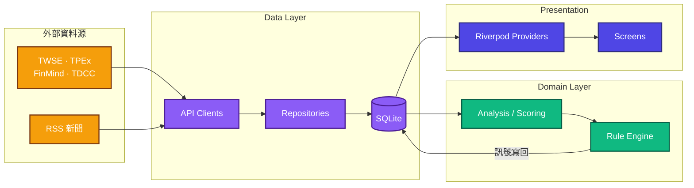

<div align="center">

# Daredevil

**Local-First 盤後台股掃描 App**

收盤後，把整個市場掃一遍，只留下「今天跟平常不一樣的地方」。

_See what changed, without noise._

[](https://flutter.dev)
[](https://dart.dev)
[](LICENSE)
[](https://github.com/Neal75418/daredevil/actions/workflows/flutter.yml)
[](https://codecov.io/gh/Neal75418/daredevil)

</div>

---

## 核心理念

> 收盤後自動掃描全市場，找出「今天跟平常不一樣」的股票

| 原則          | 說明                             | 優勢               |
|:--------------|:---------------------------------|:-------------------|
| **On-Device** | 所有運算在裝置端完成             | 隱私保護、離線可用 |
| **零成本**    | 免費公開 API + 本地 SQLite       | 無月費、無訂閱     |
| **盤後批次**  | 收盤後一次更新                   | 省電、省流量       |
| **異常提示**  | 只說「發生什麼」不說「該怎麼做」 | 客觀、不帶立場     |

---

## 功能

| 頁面                   | 功能                                                    |
|:-----------------------|:--------------------------------------------------------|
| **Today**              | 市場摘要 + 三模式選股（起漲候選 / 強勢觀察 / 回檔觀察） |
| **Scan**               | 上市櫃全市場掃描，依評分排序                            |
| **Watchlist**          | 自選清單狀態追蹤 + 無限滾動分頁                         |
| **Stock Detail**       | 趨勢、關鍵價位、推薦理由、新聞                          |
| **Comparison**         | 多檔股票並列比較                                        |
| **Portfolio**          | 持倉追蹤與損益計算                                      |
| **News**               | 多源 RSS 新聞彙整                                       |
| **Alerts**             | 23 種價格與技術指標警示                                 |
| **Calendar**           | 事件行事曆                                              |
| **Industry**           | 產業概覽                                                |
| **Short Sell Ranking** | 融券排行                                                |
| **Institutional**      | 法人買賣超                                              |
| **Quarterly**          | 季報財務                                                |
| **Revenue**            | 月營收                                                  |
| **Settings**           | 偏好設定                                                |
| **Onboarding**         | 首次使用引導                                            |

---

## 技術棧

| 類別            | 技術                     |
|:----------------|:-------------------------|
| Framework       | Flutter 3.38 + Dart 3.10 |
| State           | Riverpod 3.2.1           |
| Database        | Drift (SQLite) 2.32      |
| Network         | Dio 5.9.2                |
| Navigation      | GoRouter 17.1.0          |
| Crash Reporting | Sentry 9.15.0            |
| Charts          | fl_chart + k_chart_plus  |
| Code Gen        | Drift Dev                |
| Testing         | Flutter Test + Mocktail  |
| CI/CD           | GitHub Actions + Codecov |

---

## 資料來源

| 資料     | 來源                                     | 頻率 |
|:---------|:-----------------------------------------|:-----|
| 台股日價 | TWSE / TPEX Open Data (主)、FinMind (備) | 每日 |
| 法人籌碼 | TWSE T86 / TPEX（免費全市場）            | 每日 |
| 基本面   | TWSE / TPEX / FinMind                    | 每週 |
| 集保分布 | TDCC                                     | 每週 |
| 新聞     | 多源 RSS                                 | 即時 |

---

## 架構

### 資料流



### 目錄結構

```
lib/
├── core/
│   ├── constants/       # RuleParams (8 param 檔) + 閾值 / 設定常數
│   ├── exceptions/      # AppException sealed hierarchy
│   ├── services/        # CacheWarmup, Notification, Share
│   ├── theme/           # AppTheme, DesignTokens, IndicatorColors
│   └── utils/           # Logger, Result, Calendar, RequestDeduplicator, LruCache
├── data/
│   ├── database/        # Drift SQLite (tables + DAOs)
│   ├── remote/          # TWSE, TPEX, FinMind, TDCC, RSS（5 資料源）
│   ├── repositories/    # Repository 實作 + price source / filter helpers
│   └── models/          # API DTOs（JSON serialization）
├── domain/
│   ├── models/          # Domain 模型
│   ├── repositories/    # 抽象介面
│   └── services/
│       ├── rules/       # 規則引擎（權威數字見 RuleRegistry.defaultRules）
│       ├── update/      # syncers + helpers + coordinator
│       ├── analysis/    # 分析子服務
│       └── ...          # Scoring / Screening / RuleAccuracy 等服務
└── presentation/
    ├── providers/       # Riverpod Notifiers / Loaders / State
    ├── screens/         # 各功能頁面
    ├── controllers/     # Business logic facades
    ├── mappers/         # DTO → UI model 轉換
    └── widgets/         # 共用 UI 元件
```

---

## 效能優化

- **快取預熱** — App 啟動時預載自選股和推薦股資料，冷啟動快 30-40%
- **Request Deduplication** — 避免重複 API 呼叫，減少 30-50% 網路請求
- **無限滾動分頁** — Watchlist 和 Scan 畫面採用虛擬化列表
- **Isolate 並行運算** — 評分引擎使用 Isolate，typed DTO 序列化通訊
- **資料庫索引優化** — 關鍵表格加入複合索引，查詢速度提升 30%

---

## 推薦系統

70 條異常偵測規則（產生 72 種 reason type），涵蓋技術型態、價量訊號、籌碼面、
基本面、風險警示與強股回檔六大類——各類的規則明細與觸發條件見
[docs/RULE_ENGINE.md](docs/RULE_ENGINE.md)。

- 每日掃描上市 + 上櫃全市場，依「股票在趨勢中的階段」分流到**三個觀察模式**
  （當前可交易檔數隨新股上市／下市浮動，更新日誌的 `CandidateSelector` 會印出實際候選數）
- 每檔最多 **2 條理由**，分數上限 **80 分**
- 可調參數集中於 `lib/core/constants/rule_params_*.dart` 的 typed param classes

詳見 [docs/RULE_ENGINE.md](docs/RULE_ENGINE.md)

---

## 開始使用

### 環境需求

- Flutter 3.38+ / Dart 3.10+
- Android Studio 或 VS Code
- macOS（iOS 開發，選配）

### 安裝與啟動

```bash
git clone https://github.com/Neal75418/daredevil.git
cd daredevil
flutter pub get
dart run build_runner build --delete-conflicting-outputs
flutter run
```

### 開發指令

```bash
flutter pub get                                                # 安裝依賴
flutter test                                                   # 執行測試
flutter analyze --no-fatal-infos                               # 靜態分析（同 pre-commit hook）
dart format .                                                  # 格式化程式碼
dart run build_runner build --delete-conflicting-outputs        # 程式碼生成
```

---

## 測試

測試數量與覆蓋率以 [CI](https://github.com/Neal75418/daredevil/actions/workflows/flutter.yml) 與
[Codecov](https://codecov.io/gh/Neal75418/daredevil) 為準；各層覆蓋率目標見
[CLAUDE.md](CLAUDE.md) 的「測試」章節。

```bash
flutter test                       # 快速測試
flutter test --coverage            # 含覆蓋率報告
flutter test test/domain/services/ # 測試特定目錄
```

---

## 文件

| 文件                                                 | 說明                     |
|:-----------------------------------------------------|:-------------------------|
| [CLAUDE.md](CLAUDE.md)                               | AI 開發指引              |
| [RELEASE.md](RELEASE.md)                             | 發布建置指南             |
| [CHANGELOG.md](CHANGELOG.md)                         | 版本變更紀錄             |
| [docs/RULE_ENGINE.md](docs/RULE_ENGINE.md)           | 規則引擎定義 (70 條規則) |
| [docs/PENDING_UPGRADES.md](docs/PENDING_UPGRADES.md) | 依賴升級紀錄             |

---

## 免責聲明

本應用程式僅供資訊參考，不構成任何投資建議。所有資料來源為公開 API，不保證即時性與準確性。投資決策應由使用者自行判斷。

---

## 授權

[MIT License](LICENSE) © 2026 Neal Chen

---

<div align="center">

**Daredevil** — _See what changed, without noise._

Made with ❤️ for Taiwan Stock Market

</div>
