# 🧠 Rule Engine

> ← [Back to README](../README.md)

Daredevil 推薦規則引擎 — **70 條異常偵測規則**（產生 72 種 reason type）

> 權威數字：`RuleRegistry.defaultRules.length` 與 `ReasonType` enum。
>
> **守門範圍**：`doc_rule_count_consistency_test.dart` 只守四份文件標題那一處總數；
> `rule_engine_doc_test.dart` 額外守本檔的**規則集合**與**基準分欄**。觸發條件那一欄是
> 散文，兩者都守不住——改規則時請一併更新（post-commit 會提醒）。

---

## 🚨 「基準分」不是實際生效的分數

各表的「基準分」是 `RuleScores` 的**硬編碼 fallback**，只有在該規則沒有校準值時才生效：

```dart
score += (calibrated ?? reason.score) * decayMultiplier;   // rule_engine.dart
```

`calibrated` 走三態查找（`CalibratedScoresTable.lookup`）：有 active 校準值 → 用它；
落在負證據歸零集 → **回 0**；否則才 fallback 到這裡印的基準分。校準值**每個 horizon
（5D / 60D）各自獨立**，且可經 OTA 更新而不動 code。

實務後果：2026-08-23 實測，短線有 **11 條規則被歸零**（`PATTERN_GAP_UP`、`VOLUME_SPIKE`、
`MA_ALIGNMENT_BULLISH` 等），另有數條被覆蓋成不同的值。**查實際生效分數請跑**：

```bash
dart run tool/recalibrate.dart --db tool/calibration.db --dry-run
```

輸出尾端的「Promote 影響(App 有效分數)」就是答案。校準機制詳見
[docs/CALIBRATION.md](CALIBRATION.md)。

---

## 🎯 定位


| 項目 | 說明                    |
|:---|:----------------------|
| 目的 | 異常提示（Attention Alert） |
| 產出 | 互斥收斂後的理由（6 組各留最高分，輸家直接丟棄），落庫上限 64 條；卡片顯示 2 條（compact 1 條）、詳情頁 3 條 |
| 分數 | 落庫分數 0 ~ 80（負分歸零、上限 80）；三模式排行用的是 `daily_reason` 聚合，無地板無上限 |
| 輸出 | 三模式選股（起漲 / 強勢 / 回檔）   |

---

## 📈 技術型態

### 基礎規則

| 規則                  | 基準分 | 條件                         |
|:--------------------|----:|:---------------------------|
| REVERSAL_W2S        | +35 | 弱轉強（限 trendState ∈ 下跌/盤整）：突破區間上緣 **或** 形成更高低點；兩者皆需量能確認 |
| REVERSAL_S2W        | -25 | 強轉弱（限 trendState ∈ 上升/盤整）：跌破支撐 **或** 跌破區間底部 **或** 形成更低高點 |
| TECH_BREAKOUT       | +25 | 突破壓力位：3% buffer + close ≥ MA20 + **今日量 ≥ 1.5× 20 日均量** |
| TECH_BREAKDOWN      | -20 | 跌破支撐位（3% buffer + 量能確認；無 MA20 過濾，多空不對稱為現狀，對稱化需回測驗證） |
| VOLUME_SPIKE        | +22 | 量 >= 4x 均量且價變 >= 1.5%      |
| PRICE_SPIKE         | +15 | 日漲幅 >= 5% + **量 ≥ 1.5× 20 日均量**（僅正向；空方由 PRICE_VOLUME_BEARISH_DIVERGENCE / TECH_BREAKDOWN 覆蓋，2026-07 audit 修正） |
| INSTITUTIONAL_BUY   | +18 | 法人買超：轉向 / 加速擴大 / 顯著單日（>5000 張 + >35% 佔量 + 價漲 >1%）共 3 類 |
| INSTITUTIONAL_SELL  | -12 | 法人賣超：同上三類的空方版                     |
| NEWS_RELATED        |  ±8 | 近期相關新聞                     |

### K 線型態

| 規則                           | 基準分 | 說明        |
|:-----------------------------|----:|:----------|
| PATTERN_DOJI                 | +10 | 十字線（低檔猶豫） |
| PATTERN_DOJI_BEARISH         |  -5 | 十字線（高檔警示） |
| PATTERN_BULLISH_ENGULFING    | +22 | 多頭吞噬      |
| PATTERN_BEARISH_ENGULFING    | -10 | 空頭吞噬      |
| PATTERN_HAMMER               | +18 | 錘子線（底部反轉） |
| PATTERN_HANGING_MAN          | -12 | 吊人線（頭部警示） |
| PATTERN_GAP_UP               | +20 | 跳空上漲      |
| PATTERN_GAP_DOWN             |  -8 | 跳空下跌      |
| PATTERN_MORNING_STAR         | +25 | 晨星（底部反轉）  |
| PATTERN_EVENING_STAR         | -10 | 暮星（頭部反轉）  |
| PATTERN_THREE_WHITE_SOLDIERS | +22 | 三白兵       |
| PATTERN_THREE_BLACK_CROWS    | -18 | 三黑鴉       |

---

## 📉 價量訊號

### 技術指標

| 規則                     | 基準分 | 條件               |
|:-----------------------|----:|:-----------------|
| WEEK_52_HIGH           | +28 | 距 52 週新高 **1% 內**（除權息調整後）——「接近新高」也會觸發 |
| WEEK_52_LOW            |  +8 | 距 52 週新低 **3% 內** **且** close < MA20 < MA60（空方確認）|
| MA_ALIGNMENT_BULLISH   | +22 | 多頭排列 5>10>20>60（每段間距 > 0.3%）+ close > MA5 + 乖離 < 5% + 量 > 1.3× 均量 |
| MA_ALIGNMENT_BEARISH   | -15 | 空頭排列（間距 > 0.3%）+ close < MA5 + 乖離 > −5%；**無量能濾網**（與多方不對稱為現狀） |
| RSI_EXTREME_OVERBOUGHT |  -8 | RSI > 85（警示）     |
| RSI_EXTREME_OVERSOLD   | +10 | RSI < 30（反彈機會）   |
| KD_GOLDEN_CROSS        | +18 | K 上穿 D 於低檔區 < 30 + **量 ≥ 1.5× 5 日均量** + **當日漲幅 ≥ 1%** |
| KD_DEATH_CROSS         | -12 | K 下穿 D 於高檔區 > 70 + **量 ≥ 1.5× 5 日均量** |

### 價量背離

| 規則                              | 基準分 | 說明       |
|:--------------------------------|----:|:---------|
| PRICE_VOLUME_BULLISH_DIVERGENCE |  -8 | 價漲量縮（警示） |
| PRICE_VOLUME_BEARISH_DIVERGENCE | -15 | 價跌量增（恐慌） |
| HIGH_VOLUME_BREAKOUT            | +22 | 高檔爆量突破   |
| LOW_VOLUME_ACCUMULATION         | +12 | 低檔吸籌     |

---

## 👥 籌碼面

| 規則                              | 基準分 | 條件                   |
|:--------------------------------|----:|:---------------------|
| INSTITUTIONAL_BUY_STREAK        | +20 | 法人連買 >= 4 日          |
| INSTITUTIONAL_SELL_STREAK       | -15 | 法人連賣 >= 4 日          |
| FOREIGN_SHAREHOLDING_INCREASING | +18 | 外資持股 5 日增 >= 0.5%    |
| FOREIGN_SHAREHOLDING_DECREASING | -12 | 外資持股 5 日變化落在 **(−2%, −0.5%]**；跌破 −2% 由 FOREIGN_EXODUS 專屬 |
| DAY_TRADING_HIGH                |   0 | 當沖比例落在 **[50%, 70%)**；≥70% 由 DAY_TRADING_EXTREME 專屬 |
| DAY_TRADING_EXTREME             |  -5 | 當沖比例 >= 70% + 3 萬張以上 |
| CONCENTRATION_HIGH              |   0 | 大戶持股集中度 >= 60%（noise filter, demote 0） |

---

## 🏦 基本面

### 營收與估值

| 規則                  | 基準分 | 條件                      |
|:--------------------|----:|:------------------------|
| REVENUE_YOY_SURGE   | +20 | 營收年增 > 30% + 站上 MA60 **且當日漲幅 > 1.5%** |
| REVENUE_YOY_DECLINE | -10 | 營收年減 > 20%              |
| REVENUE_MOM_GROWTH  | +15 | 營收月增連續正成長 + 站上 MA20     |
| REVENUE_NEW_HIGH    |   0 | 營收創歷史新高 **+ 站上 MA20**（noise filter, demote 0） |
| HIGH_DIVIDEND_YIELD | +18 | 殖利率 5.5%–20%（>20% 視為資料錯誤排除）+ 估值資料 ≤ 7 天新鮮 |
| PE_UNDERVALUED      | +15 | PE < 10（且 > 0）+ 站上 MA20 |
| PE_OVERVALUED       |  -8 | PE > 60 + RSI > 75      |
| PBR_UNDERVALUED     | +12 | 股價淨值比 < 0.8             |

### EPS 分析

| 規則                     | 基準分 | 條件                                |
|:-----------------------|----:|:----------------------------------|
| EPS_YOY_SURGE          | +22 | EPS 年增 >= 50% + 站上 MA60 **且當日漲幅 > 1.5%** |
| EPS_CONSECUTIVE_GROWTH | +18 | 連續 >= 2 季 EPS **年增**（比去年同季，350–380 天前）>= 10% + 站上 MA20 |
| EPS_TURNAROUND         | +15 | 前季虧損、本季 EPS >= 0.3 元 **+ 站上 MA20 或 RSI > 50** |
| EPS_DECLINE_WARNING    | -12 | 連續 2 季 EPS **年減**（比去年同季） >= 20%              |

### ROE 分析

| 規則            | 基準分 | 條件                                |
|:--------------|----:|:----------------------------------|
| ROE_EXCELLENT | +18 | ROE >= 15% + 站上 MA20              |
| ROE_IMPROVING | +15 | 連續 >= 2 季 ROE 改善 >= 5pt + 站上 MA20 |
| ROE_DECLINING | -10 | 連續 >= 2 季 ROE 衰退 >= 5pt           |

---

## 🚨 殺手級功能

### 警示股票

| 規則                        | 基準分 | 條件      | 來源        |
|:--------------------------|----:|:--------|:----------|
| TRADING_WARNING_ATTENTION | -15 | 被列為注意股票 | TWSE/TPEX |
| TRADING_WARNING_DISPOSAL  | -50 | 被列為處置股票 | TWSE/TPEX |

### 董監持股

| 規則                         | 基準分 | 條件             |
|:---------------------------|----:|:---------------|
| INSIDER_SELLING_STREAK     | -25 | 董監連續減持 >= 3 個月 |
| INSIDER_SIGNIFICANT_BUYING | +20 | 董監增持 >= 5%     |
| HIGH_PLEDGE_RATIO          | -18 | 質押比例 >= 70%    |

### 外資集中度

| 規則                            | 基準分 | 條件              |
|:------------------------------|----:|:----------------|
| FOREIGN_CONCENTRATION_WARNING |  -8 | 外資持股 >= 60%     |
| FOREIGN_EXODUS                | -20 | 5 日外資流出 >= 2%   |

---

## 📐 均線階梯

四階梯狀提醒的訊號來源（2026-08 新增）。共用前置：**ETF 一律排除**、需至少 2 根 K 棒；
穿越以**收盤價跨越**判定（前一日在線的另一側），不是盤中觸價。

| 規則           | 基準分 | 條件                                    |
|:-------------|----:|:--------------------------------------|
| RECLAIM_MA20 |  +8 | 站回月線：前日 close ≤ MA20 且今日 close > MA20 |
| RECLAIM_MA60 |  +8 | 站回季線：同上，對 MA60                        |
| BREAK_MA20   |  -8 | 跌破月線：前日 close ≥ MA20 且今日 close < MA20 |
| BREAK_MA60   |  -8 | 跌破季線：同上，對 MA60                        |

> ⚠️ **RECLAIM 兩條的實證結果是負的**：2026-08-22 校準實測
> `RECLAIM_MA20` t=−6.39（n=13.8 萬）、`RECLAIM_MA60` t=−7.46（n=7 萬），
> 「站回均線」作為看多訊號的命題被推翻。BREAK 兩條是空方警示，負報酬代表命題成立。

蓄勢（均線之下但未破壞中期結構）：

| 規則                 | 基準分 | 條件                                          |
|:-------------------|----:|:--------------------------------------------|
| COILING_BELOW_MA20 |  +8 | 收盤在 MA20 下方但距離 < 3%，且近 60 日報酬 > 10%（ETF 排除） |
| COILING_BELOW_MA60 |  +8 | 同上，對 MA60                                   |

> 3% 與 10% 兩個門檻為 2026-07 三個歷史日實證校定
> （`PullbackParams.coilingMaxDistancePct` / `coilingMin60dReturnPct`）。

---

## 🔄 強股回檔（Mode C v2）

### 回檔進場

四條共用 `pullbackPrologue` 三道前置,任一不過就整組 no-fire:
**ETF 一律排除**、**大盤非上升趨勢時不觸發**(`isMarketUptrend == false`)、
**至少 21 根 K 棒**。

> 「大盤上升趨勢」= 候選宇宙 120 交易日報酬的**中位數** > 0,等價於「過半
> 股票在漲」(2026-08-29 起;此前用等權平均,實測 180 個可判定日裡 179 天
> 判多頭 —— 少數多倍股主導了兩千檔的平均)。資料不足回 null 時視為
> permissive、不擋規則。

各條另需:過去 20 日強勢(MA > 20 日前收盤 × 1.05)、
當日非跌停(≥ −9.5%)、近 5 日至少 1 根紅 K。

| 規則                | 基準分 | 條件                            |
|:------------------|----:|:------------------------------|
| PULLBACK_TO_MA20  | +15 | 強勢趨勢拉回 MA20、量縮、趨勢未破           |
| PULLBACK_TO_MA10  | +12 | 淺回檔至 MA10；需 `close > MA20 × 1.03`（突破 MA20 拉回帶上緣，與深回檔互斥）、量縮 |
| HAMMER_AT_SUPPORT | +18 | 拉回 MA20/MA60 支撐 + 錘子線止跌       |
| KD_HIGH_PULLBACK  | +12 | KD 高檔回落未死叉、多頭排列維持             |

---

## 🧮 分數合成

```mermaid
%%{init: {'theme': 'dark'}}%%
flowchart LR
    Fire["規則觸發"] --> Mutex["互斥收斂<br/>6 組各留最高分"]
    Mutex --> Lookup["校準查找<br/>三態"]
    Lookup --> Decay["基本面遞減<br/>1.0 / 0.5 / 0.25"]
    Decay --> Sum["加總 + 夾住<br/>上限 80"]
    Sum --> Gate["落庫閘門<br/>|raw| ≥ 8"]

    classDef src fill:#2563EB,stroke:#1D4ED8,stroke-width:2px,color:#FFFFFF
    classDef filt fill:#7C3AED,stroke:#5B21B6,stroke-width:2px,color:#FFFFFF
    classDef eng fill:#4F46E5,stroke:#3730A3,stroke-width:2px,color:#FFFFFF
    classDef calc fill:#059669,stroke:#047857,stroke-width:2px,color:#FFFFFF
    classDef out fill:#D97706,stroke:#B45309,stroke-width:2px,color:#FFFFFF
    classDef gate fill:#DC2626,stroke:#991B1B,stroke-width:2px,color:#FFFFFF

    class Fire src
    class Mutex filt
    class Lookup eng
    class Decay calc
    class Sum out
    class Gate gate
```



每檔股票會**跑兩次**（`Horizon.short` = 5D、`Horizon.long` = 60D），各得一個分數。

| 階段 | 邏輯 |
|:---|:---|
| 互斥收斂 | `RuleEngine._mutexGroups` 6 組，每組只留分數最高的一條，其餘**直接丟棄**（不是去重） |
| 校準查找 | `(calibrated ?? reason.score)`——三態：active 校準值／負證據歸零回 0／null 才用基準分 |
| 基本面遞減 | 同群組內第 1／2／3+ 條分別乘 1.0／0.5／0.25（`fundamental_decay_groups.dart`） |
| 加總 + 夾住 | `calculateScore` 是純算術：加總後夾上限 80。**沒有「加成」階段** |
| 負分歸零 | 落庫前地板為 0；但內部 raw 分數是**有號的**（`floorAtZero: false`） |
| 落庫閘門 | `|rawShort| ≥ 8 或 |rawLong| ≥ 8` 才寫 `daily_analysis`（MA 階梯穿越另有豁免） |

**投信主導 ±5** 不是合成階段的加成——它在規則內部就併進 `TriggeredReason.score`：
買超連續 **+5**、賣超連續 **−5**（`institutional_rules.dart`）。2026-04 移除的是
VOLUME／BREAKOUT 的組合加成。

**三模式排行不吃這個分數。** 三個 tab 排的是 `daily_reason` 的 `SUM(rule_score_short)`，
既沒有地板也沒有上限——`ModeFilters` 明確預期負的 mode 分數。

---

## ⚙️ 關鍵參數

> 來源：`lib/core/constants/rule_params.dart` barrel（`RuleParams` 本身 + 8 個 domain
> class：Trend / Indicator / Institutional / Fundamental / Pattern / Pullback / Sector /
> Alert）。下表只列常查的幾個，完整清單見 `rule_params*.dart`。

| 參數                          |   值 | 說明         |
|:----------------------------|----:|:-----------|
| lookbackPrice               | 370 | 分析視窗（日曆日）  |
| volMa                       |  20 | 均量計算天數     |
| volumeSpikeMult             |  4x | 放量門檻       |
| breakoutBuffer              |  3% | 突破緩衝區      |
| institutionalStreakDays     |   4 | 法人連續買賣天數   |
| insiderSellingStreakMonths  |   3 | 董監連續減持月數   |
| highPledgeRatioThreshold    | 70% | 高質押門檻      |
| foreignConcentrationWarningThreshold | 60% | 外資集中警告（另有 Danger 70%） |
| concentrationHighThreshold  | 60% | 籌碼集中度門檻    |
| peOvervaluedThreshold       |  60 | PE 過高警示門檻  |
| epsYoYSurgeThreshold        | 50% | EPS 年增暴增門檻 |
| epsConsecutiveQuarters      |   2 | EPS 連續成長季數 |
| roeExcellentThreshold       | 15% | ROE 優異門檻   |
| minScoreThreshold           |  12 | 「訊號成立」分級界線（**不是**落庫閘門）     |
| observationScoreThreshold   |   8 | **落庫閘門**：|raw| ≥ 8 才寫 daily_analysis |

---

## 💾 資料表

| 表                    | 用途       |
|:---------------------|:---------|
| stock_master         | 股票主檔     |
| daily_price          | 日 K 資料   |
| daily_institutional  | 法人買賣超    |
| trading_warning      | 注意/處置股票  |
| insider_holding      | 董監持股     |
| daily_analysis       | 分析結果     |
| daily_reason         | 觸發理由（三模式選股即時聚合來源） |

規則另外會讀這些來源表（缺資料時對應規則自然 no-fire）：

| 表                    | 支撐的規則                                        |
|:---------------------|:---------------------------------------------|
| shareholding         | FOREIGN_SHAREHOLDING_INCREASING / DECREASING / EXODUS |
| holding_distribution | CONCENTRATION_HIGH、FOREIGN_CONCENTRATION_WARNING |
| day_trading          | DAY_TRADING_HIGH / EXTREME                   |
| monthly_revenue      | REVENUE_* 四條                                 |
| financial_data       | EPS_* 四條、ROE_* 三條                            |
| stock_valuation      | HIGH_DIVIDEND_YIELD、PE_*、PBR_UNDERVALUED      |
| news_item            | NEWS_RELATED                                 |
| rule_accuracy        | 校準回饋迴路（見 [CALIBRATION.md](CALIBRATION.md)）   |

---

← [Back to README](../README.md) | 📚 [All Documentation](../README.md#文件)
